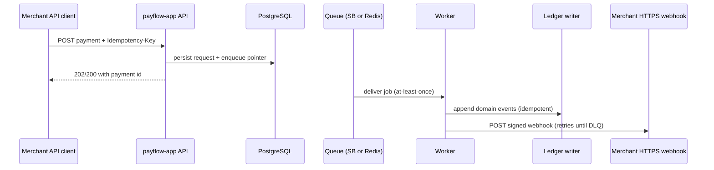
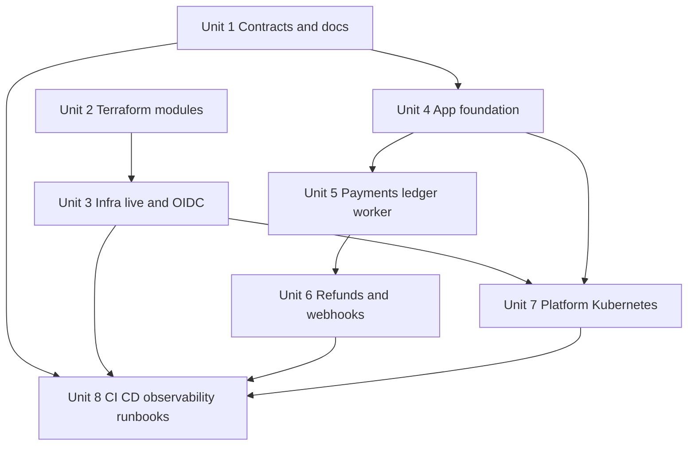

# feat: PayFlow multi-repo Azure platform and application

## Overview

Deliver **PayFlow** as four lifecycle-separated directories under the current workspace (`payflow-app`, `payflow-terraform-modules`, `payflow-infra-live`, `payflow-platform-config`) matching **R25**, with an **Azure-first** story (**AKS**, **VNET**, **Key Vault**, **Terraform**, **GitHub Actions** with **OIDC** and **environment-protected production**). Implement enough **application behavior** to prove **multi-tenant isolation**, **idempotent payment and refund submission**, **append-only ledger explainability**, **async processing**, **signed webhooks with retries and DLQ**, and **structured audit-oriented logging**. Layer **Kubernetes operational controls**, **observability as code**, **CI/CD**, **runbooks** for the six scenarios in **R14**, and **PCI-aligned documentation** without compliance certification claims (**R24**, **N1**).

## Problem Frame

Interviewers for EU senior DevOps / platform / SRE roles expect evidence of **controlled production change**, **segmented environments**, **secrets and identity hygiene**, **Kubernetes maturity**, and **operational narratives** tied to business risk (money movement), not only a deployed demo. The origin document defines the product and non-functional bar; this plan sequences **how** to build it from an empty scaffold. (see origin: `docs/brainstorms/payflow-requirements.md`)

## Requirements Trace

| ID | Plan coverage |
|----|----------------|
| R1–R7, S1 | Application services, OpenAPI-level contracts, lightweight dashboard, end-to-end payment narrative |
| R8, S2 | Tenant context on every path; integration tests for cross-tenant denial |
| R9–R12 | Key Vault / CSI patterns in modules and platform; no PAN; audit log events per R11 list |
| R13–R15, S5 | Service Bus (Azure) + local dev broker; K8s probes, HPA, PDB, NetworkPolicy, ingress TLS; six runbooks |
| R16–R19, S3 | Terraform modules + live env roots; OIDC for Terraform and image deploy; rollback doc (**R16** object storage is **explicitly out of scope for v1** — no blob module until an artifact-retention story is required; document that gap in Unit 2 READMEs so **R16** is still honest about “where narrative needs it”) |
| R20–R23, S4 | Prometheus rules, Grafana dashboards, SLI/SLO doc; tracing gap documented until implemented |
| R24 | `docs/compliance-considerations.md` with careful wording |
| R25–R26, S6 | Four directories + `docs/portfolio-signals.md` + strengthened per-repo READMEs |

## Scope Boundaries

- No real card data, no real money, no PCI certification claims (origin **N1**, **N12**, **R24**).
- No card network integrations (origin **N2**).
- No full GitOps implementation in phase 1 unless capacity allows; default is **pipeline-driven deploy** with GitOps listed as phase-2 optional (origin deferred question).

## Context & Research

### Relevant Code and Patterns

- **Greenfield:** only markdown scaffolds exist (`README.md`, `docs/brainstorms/payflow-requirements.md`, `docs/portfolio-signals.md`, per-repo `README.md`). Conventions below establish patterns.

### Institutional Learnings

- `docs/solutions/` is absent; no institutional YAML learnings to apply.

### External References

- GitHub Actions OIDC to Azure: [Authenticate to Azure from GitHub Actions using OpenID Connect](https://learn.microsoft.com/en-us/azure/developer/github/connect-from-azure-openid-connect), [Configuring OpenID Connect in Azure](https://docs.github.com/en/actions/deployment/security-hardening-your-deployments/configuring-openid-connect-in-azure)
- Terraform AzureRM OIDC: [Authenticating using a Service Principal and OpenID Connect](https://registry.terraform.io/providers/hashicorp/azurerm/latest/docs/guides/service_principal_oidc)
- AKS workload identity: [Use a Microsoft Entra Workload ID on AKS](https://learn.microsoft.com/en-us/azure/aks/workload-identity-overview)
- AKS ingress TLS + Key Vault CSI: [Use TLS with an ingress controller on AKS](https://learn.microsoft.com/en-us/azure/aks/ingress-tls), [Set up Secrets Store CSI Driver with NGINX Ingress TLS](https://learn.microsoft.com/en-us/azure/aks/csi-secrets-store-nginx-tls)
- Messaging comparison: [Compare Azure messaging services](https://learn.microsoft.com/en-us/azure/service-bus-messaging/compare-messaging-services), [Azure Service Bus overview](https://learn.microsoft.com/en-us/azure/service-bus-messaging/service-bus-messaging-overview)
- Idempotency behavior reference (not to copy product, to mirror concepts): [Stripe idempotent requests](https://docs.stripe.com/api/idempotent_requests)
- PostgreSQL RLS: [Row Security Policies](https://www.postgresql.org/docs/current/ddl-rowsecurity.html)

## Key Technical Decisions

- **Primary service language: Go** for API, worker, and webhook dispatcher binaries — small static images, strong fit to AKS/CNCF narrative (see repo research). **Scripting:** Make plus **Python** for glue where it reads clearer than shell.
- **Dashboard:** **TypeScript + React (Vite)** SPA for **R7** depth control; authenticates to same backend with **JWT/session** path separate from **API keys** (**R2**). Alternative deferred: server-rendered dashboard only if scope threatens delivery.
- **Queue abstraction:** **Azure Service Bus** queues in **staging/prod**; **Redis (Streams or list consumer pattern)** in **local/docker-compose** behind a **Go internal interface** so tests run without Azure. Document semantic differences (ordering, DLQ) explicitly in `docs/contracts/async-plane.md`.
- **Tenant isolation:** **Mandatory application-layer enforcement** (middleware + repository predicates + tests). **PostgreSQL RLS** as **optional defense-in-depth** in a later sub-milestone after baseline tests pass — if enabled, use a non-superuser DB role and `FORCE ROW LEVEL SECURITY` policy design per PostgreSQL docs.
- **Ingress:** **NGINX Ingress Controller** + **cert-manager** on AKS for portfolio cost/clarity; **Application Gateway** documented as alternative (**R16**).
- **Azure region default:** `westeurope` for EU alignment; override via tfvars per env without changing module interfaces.
- **GitOps:** **Not** in critical path for phase 1; **Flux or Argo CD** optional phase 2 in `payflow-platform-config` (origin deferred item).

## Open Questions

### Resolved During Planning

- **Application runtime:** Go + TypeScript dashboard SPA + Python glue.
- **Broker:** Service Bus (cloud) + Redis (local) behind one internal queue interface.
- **Ingress front door:** NGINX + cert-manager default; AGW documented.
- **Refund idempotency contract:** Same logical rule as payments: **unique (tenant_id, scope, idempotency_key)** where `scope` distinguishes `payment:create` vs `refund:create`; document in `docs/contracts/idempotency.md`.
- **Idempotency key collision across tenants:** Keys are **scoped per tenant**; cross-tenant same string is allowed and must not collide in storage.

### Deferred to Implementation

- Exact **OpenAPI** paths and field names; **migration** ordering for additive-only vs breaking changes.
- **Service Bus** SDK retry defaults vs explicit handler idempotency — validate under fault injection.
- **Trace exporter** choice (OTLP to Grafana Cloud vs self-hosted) once AKS add-ons are fixed.

## High-Level Technical Design

> *This illustrates the intended approach and is directional guidance for review, not implementation specification. The implementing agent should treat it as context, not code to reproduce.*

## Implementation Unit Dependency Graph

## Implementation Units

- [x] **Unit 1: Contracts, cross-repo checklist, and README depth**

**Goal:** Make the four-repo handoff **machine- and human-readable** (origin **R26**, **S6**, spec-flow gap “interface doc”).

**Requirements:** R25, R26, S6; supports S3/S5 indirectly via documented promotion.

**Dependencies:** None.

**Files:**
- Create: `docs/contracts/idempotency.md`
- Create: `docs/contracts/async-plane.md`
- Create: `docs/contracts/release-checklist.md`
- Modify: `README.md`, `payflow-app/README.md`, `payflow-terraform-modules/README.md`, `payflow-infra-live/README.md`, `payflow-platform-config/README.md`, `docs/portfolio-signals.md`

**Approach:** Document **idempotency key uniqueness**, **ledger event dedupe strategy**, **webhook signing and rotation policy**, **env var contract** between Terraform outputs → platform manifests → app containers, and **migration-before-rollout** ordering. Expand READMEs to “internal engineering overview” depth (purpose, boundaries, interfaces to sibling repos, security notes).

**Normative CI layout (P0):** In `docs/contracts/release-checklist.md`, record a **single** chosen pattern before any workflow files land: **(A)** repo-root `.github/workflows/` only, with `paths` / `paths-ignore` per logical repo, **or (B)** workflows colocated under each pseudo-repo folder (understanding GitHub only executes workflows present on the default branch). **All later units reference the same letter** — no “decide in Unit 8” ambiguity after Unit 1 merges.

**Test scenarios:**
- Test expectation: none — documentation-only unit.

**Verification:** A new contributor can explain **which repo to change** for a payment bug vs an HPA change vs a VPC change without reading the whole origin doc.

---

- [x] **Unit 2: Terraform modules (`payflow-terraform-modules`)**

**Goal:** Versionable building blocks for **VNET**, **AKS** (workload identity-ready), **PostgreSQL Flexible Server**, and **Key Vault** integration patterns (origin **R16**, **R9**).

**Requirements:** R16, R10 (via managed service defaults), R15 (cluster foundation).

**Dependencies:** Unit 1 (naming and interface assumptions).

**Files:**
- Create: `payflow-terraform-modules/modules/azure_network/README.md` plus Terraform files under that module
- Create: `payflow-terraform-modules/modules/azure_aks/README.md` plus Terraform files
- Create: `payflow-terraform-modules/modules/azure_postgres/README.md` plus Terraform files
- Create: `payflow-terraform-modules/modules/azure_keyvault/README.md` plus Terraform files
- Create: `payflow-terraform-modules/examples/minimal/README.md` (wired example, no secrets committed)
- Test: `payflow-terraform-modules/test/terraform_validation_test.tftest.hcl` or CI-only `terraform validate` job documented in Unit 8 if HCL test framework is not adopted

**Approach:** Modules expose **outputs** consumed by live roots (kube config host, subnet ids, postgres fqdn, key vault uri). No environment-specific values inside modules. Document **Cilium vs Azure NPM** posture choice in module README (see Microsoft network policy guidance). **Object storage (R16):** omit Terraform for Blob/Storage Account in v1; state “deferred” and the interview phrase (“artifacts land in registry / DB only for v1”) in `payflow-terraform-modules/README.md`.

**Test scenarios:**
- Happy path: `terraform validate` and `terraform plan` against `examples/minimal` using fake variables — succeeds.
- Error path: example fails fast when required CIDR variables are missing.
- Integration: example’s output names match what `payflow-infra-live` expects (contract test via documented table in `docs/contracts/release-checklist.md`).

**Verification:** `examples/minimal` plans cleanly in CI with stub variables; module README lists inputs/outputs and **data classification** (what is secret vs output).

---

- [x] **Unit 3: Live environments and OIDC (`payflow-infra-live`)**

**Goal:** **dev / staging / prod** roots with **remote state**, **least-privilege** identities for Terraform and for later deploy workflows, and **GitHub Actions OIDC** authentication to Azure (origin **R17–R19**, **R9**, **S3**).

**Requirements:** R17, R18 (infra side), R19 (documented rollback with tf and/or release pipeline), R9.

**Dependencies:** Unit 2.

**Files:**
- Create: `payflow-infra-live/envs/dev/`, `payflow-infra-live/envs/staging/`, `payflow-infra-live/envs/prod/` (Terraform root files per env)
- Create: `payflow-infra-live/docs/rollback.md`
- Create: `.github/workflows/terraform-plan.yml` **only at the path mandated by `docs/contracts/release-checklist.md` (Unit 1 pattern A or B)** — do not add a second, conflicting workflow location.
- Test: `payflow-infra-live/test/.gitkeep` placeholder until contract tests exist; **Test expectation:** CI job runs `terraform fmt -check`, `validate`, and `plan` for **dev** on PR; **staging/prod** plans on protected branches or manual workflow_dispatch only.

**Approach:** Federated credential subjects scoped per environment and repo; document `permissions: id-token: write` requirement. Prod applies require **GitHub Environment** protection. **Dependency note:** Unit 3 file paths for workflows **must follow** the letter (A or B) locked in Unit 1 — Unit 8 extends jobs, it does not re-decide layout.

**Test scenarios:**
- Happy path: OIDC plan succeeds for dev in CI using mock subscription layout (or skip apply in public CI with documented `TF_VAR_*` stubs).
- Error path: workflow without `id-token: write` fails fast (documented negative check in runbook for pipeline authors).
- Integration: outputs from a dev plan match keys listed in `docs/contracts/release-checklist.md`.

**Verification:** Three env folders differ in **CIDRs, SKUs, and protection flags** per documented table; no plaintext secrets in git.

---

- [x] **Unit 4: Application foundation (`payflow-app`)**

**Goal:** Runnable **Go** module layout, **PostgreSQL** migrations, **tenant onboarding** sufficient for **R1** (create tenant + issue first API key or equivalent), **dual authentication** (API key vs dashboard JWT), **RBAC model** in `docs/auth-rbac.md`, **structured logging** fields (**R22**), and **audit events** for the minimum set in **R11** (including key issuance/rotation/revocation when those endpoints exist).

**Requirements:** R1, R2, R8, R9 (consume injected secrets), R11 (audit), R22.

**Dependencies:** Unit 1; local database from docker-compose (add in this unit).

**Files:**
- Create: `payflow-app/go.mod`, `payflow-app/cmd/api/main.go`, `payflow-app/cmd/worker/main.go` (stubs acceptable initially)
- Create: `payflow-app/internal/tenant/`, `payflow-app/internal/auth/`, `payflow-app/internal/audit/`
- Create: `payflow-app/db/migrations/` (SQL migrations)
- Create: `payflow-app/api/openapi.yaml`
- Create: `payflow-app/docker-compose.yml` for Postgres + Redis + optional admin tool
- Create: `docs/auth-rbac.md`
- Test: `payflow-app/internal/tenant/tenant_test.go`, `payflow-app/internal/auth/auth_test.go`, `payflow-app/test/integration/onboarding_apikey_test.go`

**Approach:** Every authenticated request resolves **tenant_id** and **principal**; repository APIs accept `TenantContext` from middleware only. JWT and API keys use separate issuance tables. Audit writes are side effects with stable `event_type` strings.

**Execution note:** Implement **tenant isolation tests** before expanding payment logic.

**Test scenarios:**
- Happy path (**R1**): create tenant → issue first API key → call a protected endpoint successfully; audit row `api_key_issued` (or named equivalent) exists.
- Happy path: API key for **Tenant A** creates a resource; same key reads it back.
- Error path: **Tenant A** key cannot read **Tenant B** resource id (404 or 403 per consistent policy — document choice in OpenAPI).
- Edge case: expired or malformed JWT for dashboard is rejected with audit `dashboard_login_failure`.
- Integration: migration applies cleanly on empty DB; rollback strategy documented for additive migrations only in early phases.

**Verification:** `go test ./...` passes for packages introduced; OpenAPI lists **securitySchemes** for `ApiKeyAuth` and `BearerAuth`.

---

- [x] **Unit 5: Payments, ledger, async worker (`payflow-app`)**

**Goal:** **POST payment** persists, enqueues work, worker advances **mock** settlement, **append-only ledger** events, **idempotency** per **R4**, consumer idempotency per **R13**.

**Requirements:** R3–R5, R13, S1, S2 (payments paths).

**Dependencies:** Unit 4; queue available locally (Redis) and interface ready for Service Bus.

**Files:**
- Create: `payflow-app/internal/payment/`, `payflow-app/internal/ledger/`, `payflow-app/internal/queue/`
- Modify: `payflow-app/cmd/api/main.go`, `payflow-app/cmd/worker/main.go`
- Modify: `payflow-app/api/openapi.yaml`
- Test: `payflow-app/test/integration/idempotency_test.go`, `payflow-app/test/integration/tenant_isolation_payments_test.go`, `payflow-app/internal/payment/payment_test.go`

**Approach:** DB uniqueness on `(tenant_id, idempotency_scope, idempotency_key)`; **first-writer-wins** replay returns stored response shape. Ledger events carry **monotonic sequence** or **deterministic event id** to detect duplicate transitions under redelivery. Worker handler must be safe under **at-least-once** delivery.

**Execution note:** Start with a **failing integration test** for duplicate concurrent `POST /payments` with the same key (spec-flow **gap 1**).

**Test scenarios:**
- Happy path: first POST creates payment + initial ledger events; GET shows progressing mock state.
- Edge case: two concurrent identical idempotency keys → single payment id; no duplicate financial ledger transition.
- Error path: idempotency key reuse with **different body** → **409** (or documented Stripe-like mismatch behavior).
- Integration: worker crash simulation — publish job twice; ledger remains consistent.

**Verification:** Integration tests pass locally with docker-compose; metrics hook points documented for **payments_created** counter (wired in Unit 8 if fast follow).

---

- [x] **Unit 6: Refunds and webhooks (`payflow-app`)**

**Goal:** **Refund** flow with idempotency decision from **R4**; **signed webhooks**, exponential backoff, **DLQ** visibility per **R6**; per-tenant webhook signing secret from Key Vault path (origin **R9**). **DLQ minimal visibility (R6):** expose **GET** list + **GET** detail on **API** for authorized roles; **dashboard** may read the same endpoints (no separate server-side DLQ logic duplicated). OpenAPI documents these routes; integration tests cover list/detail after forced failures.

**Requirements:** R3–R6, R13, R20–R21 (hooks for business metrics).

**Dependencies:** Unit 5.

**Files:**
- Create: `payflow-app/internal/refund/`, `payflow-app/internal/webhook/`
- Modify: `payflow-app/cmd/worker/main.go` to include dispatcher loop
- Modify: `payflow-app/api/openapi.yaml`
- Test: `payflow-app/test/integration/refund_state_test.go`, `payflow-app/test/integration/webhook_delivery_test.go`, `payflow-app/test/integration/webhook_dlq_api_test.go`

**Approach:** Webhook HTTP client uses timeouts; signing header includes timestamp or version if rotation is modeled; DLQ records last error and attempt count. Document merchant responsibility for **receiver idempotency** of duplicate deliveries in `docs/contracts/async-plane.md`.

**Test scenarios:**
- Happy path: payment settles → webhook **200**; delivery row `succeeded`.
- Error path: webhook target returns **500** through threshold → DLQ row with last error.
- Edge case: rotate signing secret in config — document expected behavior for in-flight retries (spec-flow **gap 5**).
- Integration: refund invalid states rejected (`pending` vs `failed` matrix from spec-flow **gap 3** — enumerate in tests).

**Verification:** OpenAPI covers refund endpoint; integration tests use **httptest** server as webhook target.

---

- [x] **Unit 7: Platform Kubernetes (`payflow-platform-config`)**

**Goal:** Deploy workloads to **AKS** with **ingress + TLS**, **PDB**, **HPA**, **NetworkPolicy**, workload **ServiceAccount** wired for **Workload Identity**, non–cluster-admin RBAC (**R15**).

**Requirements:** R15, R16 (runtime side), R10 (TLS), S3 (runtime half).

**Dependencies:** Unit 3 (cluster exists); Unit 4–6 (container images exist in registry or use public placeholder until CI publishes).

**Files:**
- Create: `payflow-platform-config/base/` and `payflow-platform-config/overlays/dev|staging|prod/`
- Create: `payflow-platform-config/policies/network/` (NetworkPolicy manifests)
- Create: `payflow-platform-config/policies/rbac/` (Role/RoleBinding for namespaces)
- Test: Test expectation: none for raw YAML — **Verification** via `kubectl kustomize` / `kubeconform` in CI (Unit 8) plus cluster smoke checklist in `docs/contracts/release-checklist.md`.

**Approach:** Kustomize by default; image tags pinned per overlay; **PodDisruptionBudget** on API deployment; **HorizontalPodAutoscaler** on worker or API based on CPU or **KEDA** if queue metric is chosen later (document choice).

**Test scenarios:**
- Happy path: `kustomize build overlays/dev` renders without error.
- Error path: overlay missing image tag fails CI policy check (lint script).
- Integration: smoke checklist executes after staging deploy (from Unit 8).

**Verification:** Staging overlay differs from prod in **replicas, PDB minAvailable, and resource limits** per env table in Unit 1 docs.

---

- [x] **Unit 8: CI/CD, observability, runbooks, compliance (`cross-cutting`)**

**Goal:** **GitHub Actions** workflows at the **single layout** from Unit 1: **lint, test, scan, build/push**, **Terraform plan/apply** with **environment gates** for prod (**R18**, **S3**); **Prometheus rules + Grafana dashboards as code** (**R20–R21**, **S4**); **SLI/SLO** document (**R20**); **six runbooks** (**R14**, **S5**); **compliance considerations** doc (**R24**); optional **OTLP tracing** stub (**R23** gap explicit if not done).

**Requirements:** R18–R21, R23 (gap or implementation), R24, S3–S5, portfolio alignment paragraph in origin.

**Dependencies:** Units 1–7 materially; can stub metrics in earlier units.

**Sequencing inside Unit 8:** Land **minimal CI** (fmt/validate/test/scan on PR) **before** full observability YAML and all six runbooks if schedule slips; **runbooks and SLO doc** may proceed in parallel with app Units 5–6 **only** where they reference signals already defined (placeholders allowed with explicit “signal not wired until …” labels). **DB saturation (R14 item 3):** runbook-only load test in v1 unless an optional k6 job is added — state that explicitly in `docs/runbooks/db-saturation.md`.

**Files:**
- Create: `.github/workflows/` at the **Unit 1–mandated** path only (see `docs/contracts/release-checklist.md`)
- Create: `payflow-platform-config/observability/prometheus/`, `payflow-platform-config/observability/grafana/`
- Create: `docs/slo/payment-api-slo.md` (or under `payflow-platform-config/docs/`)
- Create: `docs/runbooks/` (six files aligned to R14 naming)
- Create: `docs/compliance-considerations.md`
- Test: `payflow-app` keeps Go tests; add `scripts/ci/lint-yaml.sh` with tests **not** required if pure bash — use `Test expectation: none — shell linted by CI step` and document in checklist.

**Approach:** **Trivy** or **Grype** image scan, **gitleaks** or GitHub secret scanning, **dependabot** config. Production deploy job uses **`environment: production`** with required reviewers. Document GitLab/Azure DevOps mapping in `docs/ci-platform-mapping.md` (small file).

**Test scenarios:**
- Happy path: PR pipeline passes on clean tree for all four repos’ touched paths.
- Error path: introduce dummy secret pattern — gitleaks fails.
- Integration: post-deploy smoke hits `/healthz` and one authenticated payment flow in **staging** only.

**Verification:** `docs/runbooks/` contains six documents each with **signals**, **mitigations**, and **links** to dashboards; `docs/compliance-considerations.md` avoids certification language.

---

## System-Wide Impact

- **Interaction graph:** Terraform outputs → Kubernetes Secrets/CSI objects → app env; CI OIDC → AzureRM provider; GitHub image digest → Kustomize image tag; worker → Service Bus/Redis → webhook HTTP.
- **Error propagation:** Queue redelivery must not surface as duplicate money movement; API maps infrastructure errors to **503** with `request_id` only.
- **State lifecycle risks:** Partial writes between payment row and outbox row — use **transactional outbox** pattern or single-writer sequence documented in `docs/contracts/async-plane.md`.
- **API surface parity:** Dashboard and API key clients hit the same core use cases where overlap exists (read payment status); RBAC still applies (**R2**, **R6**).
- **Integration coverage:** Staging smoke and integration tests together prove **S2** and **S1**; production proof is procedural (gates), not automated in public CI without secrets.
- **Unchanged invariants:** PCI-aligned wording and **no PAN** remain true across all units.

## Risks & Dependencies

| Risk | Mitigation |
|------|------------|
| Azure cost / subscription access | Document **dev** SKUs and teardown; provide **docker-compose** full local path for demos without cloud |
| Queue semantic mismatch (Redis vs Service Bus) | Single Go interface; contract tests for both drivers where feasible; explicit semantic doc |
| Over-scoping GitOps + multi-region | Phase GitOps as optional; single region default |
| RLS complexity delaying MVP | Application-layer isolation first; RLS optional milestone |
| Public CI cannot apply to real Azure | Use **plan-only** jobs publicly; apply documented as manual with OIDC in private pipeline or documented `act` limitations |

## Documentation / Operational Notes

- Maintain **origin traceability**: when behavior changes, update **requirements** only via new brainstorm if product intent shifts; otherwise update plan append-only with date notes.
- **Image promotion:** document digest-pinning vs semver tags in `docs/contracts/release-checklist.md`.

## Sources & References

- **Origin document:** [docs/brainstorms/payflow-requirements.md](../brainstorms/payflow-requirements.md)
- **Portfolio matrix:** [docs/portfolio-signals.md](../portfolio-signals.md)
- External docs listed under **Context & Research**

## Phased Delivery (maps to origin “Layers”)

| Phase | Layers (origin) | Units |
|-------|------------------|-------|
| P1 | Layer 1 runnable core | 1, 4, 5 (local only) |
| P2 | Layer 2 Terraform + AKS + CI | 2, 3, 7, 8 (subset) |
| P3 | Layer 3 observability + security polish | 8 (observability), 4–6 hardening, optional RLS |
| P4 | Layer 4 failure simulations + runbooks | 8 (runbooks), game-day checklists |

## Confidence Check (Phase 5.3 summary)

Plan depth: **Deep**. Topic risk: **high** (auth, payments-shaped correctness, secrets, CI/CD). Thin local patterns triggered explicit **external references** and **contract-first** documentation (Unit 1) plus **integration-first** tests for idempotency and tenancy. Deepening integrated into **Key Technical Decisions**, **Risks**, and **spec-flow** test bullets without a separate agent pass.

**Document review (post-write):** Headless review flagged workflow-path timing, **R1** onboarding tests, **R16** storage scope, **R6** DLQ API visibility, and **Unit 8** sequencing; those items are integrated above (CI layout locked in Unit 1, object storage explicitly deferred for v1, DLQ list/detail via API + tests, onboarding integration test, Unit 8 stub-first note, DB saturation runbook-only default).

---

## Alternative Approaches Considered

- **Java (Spring) instead of Go:** Strong in EU enterprises; heavier container and JVM tuning story. Rejected as default to keep operational surface focused on Kubernetes and small images.
- **Only Redis in all envs:** Simpler; weaker Azure messaging interview story. Rejected for staging/prod default.
- **Application Gateway as default ingress:** Strong enterprise narrative; higher cost and setup. Deferred as documented alternative.
